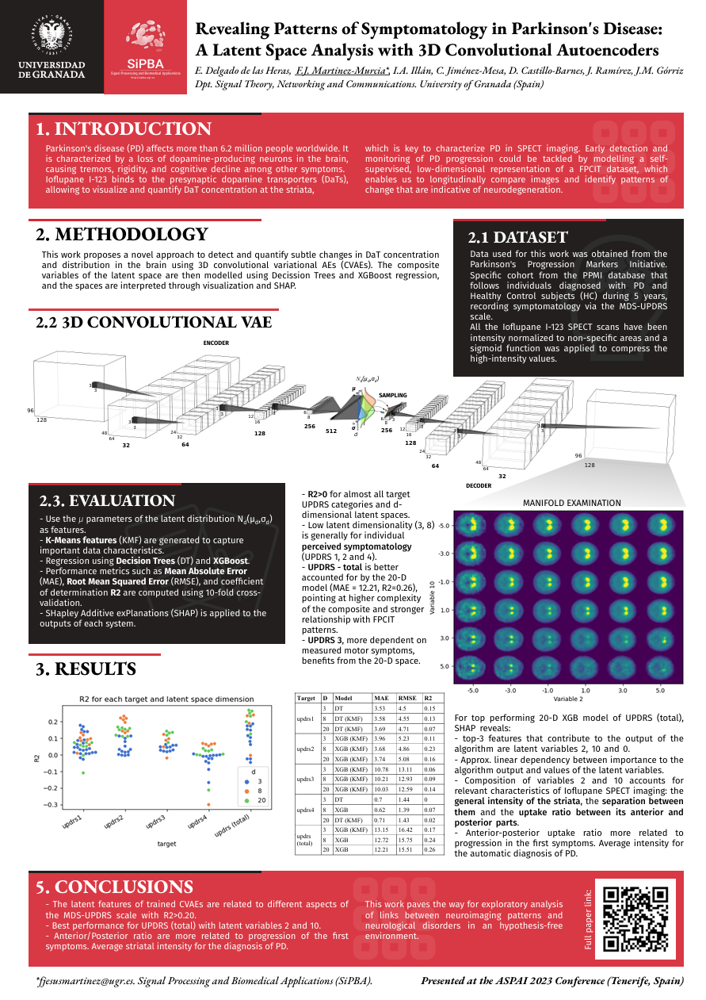

# Estudio de la Progresión de la Enfermedad de Parkinson mediante Análisis del Espacio Latente con Autoencoders Convolucionales 3D

Este proyecto investiga la progresión de la Enfermedad de Parkinson (EP) utilizando Autoencoders Convolucionales Variacionales 3D (CVAE) para analizar imágenes cerebrales (SPECT DaTSCAN). El objetivo es identificar patrones en el espacio latente de estas imágenes y correlacionarlos con la sintomatología clínica (escala MDS-UPDRS) para mejorar la comprensión y el diagnóstico temprano de la enfermedad.

El código fuente y los resultados de este trabajo están asociados a la publicación:
*   E. Delgado de las Heras, F.J. Martinez-Murcia, I.A. Illán, C. Jiménez-Mesa, D. Castillo-Barnes, J. Ramírez, J.M. Górriz. (2023). *Revealing Patterns of Symptomatology in Parkinson’s Disease: A Latent Space Analysis with 3D Convolutional Autoencoders*. Preprint. ([PDF disponible aquí](resultados_investigacion/articulo/articulo_arxiv.pdf)) 

Este repositorio también contiene el trabajo desarrollado para el Trabajo Fin de Grado:
*   "Estudio de la progresión de la enfermedad de Parkinson utilizando aprendizaje profundo" por Enrique Sebastián Delgado de las Heras (Universidad de Granada, 2023). Directores: Francisco Jesús Martínez Murcia, Ignacio Álvarez Illán.


## Contenido del Repositorio

*   **`/src`**: Código fuente en Python.
    *   `main.py`: Script principal que configura el sistema, entrena el modelo seleccionado (PCA, CAE, CVAE) y representa el espacio latente.
    *   `train.py`: Contiene las funciones principales para el entrenamiento de los modelos (CAE, CVAE, PCA), incluyendo el cálculo de pérdidas y la generación de variables latentes.
    *   `models.py`: Define las arquitecturas de los modelos de deep learning (CAE_3D y CVAE_3D).
    *   `loss.py`: Define las funciones de pérdida específicas para los modelos CAE (Error Cuadrático Medio) y CVAE (Reconstrucción + Divergencia KL).
    *   `loader.py`: Implementa el cargador de datos (`ImageDataset`, `ImageDatasetNuevo`) para procesar imágenes médicas en formato NIfTI, incluyendo preprocesamiento como normalización y padding.
    *   `prepare_dataset.py`: Prepara el conjunto de datos, asociando imágenes con información temporal y de pacientes, generando un CSV para el entrenamiento.
    *   `utils.py`: Contiene funciones auxiliares para el análisis (generación de DataFrames latentes) y visualización (representación del espacio latente, guardado de imágenes reconstruidas, animación del espacio latente, visualización de pérdidas).
    *   `animacion.py`: Genera animaciones del proceso de entrenamiento (cortes axiales, coronales, sagitales; función de pérdida; espacio latente) y combina vídeos.
    *   `AnalisisResultados.py`: Realiza análisis cuantitativo y descriptivo de los resultados, usando regresión lineal y de procesos gaussianos para evaluar las variables latentes y su efecto en las imágenes reconstruidas.
    *   `image_norms.py`: Define diversos métodos de normalización para las imágenes médicas (mediana, media, Otsu, GMM).
*   **`/datos`**:
    *   `IntensityNorm_Afin_PPMI_mask.nii`: Máscara NIfTI utilizada para la normalización de imágenes médicas en algunos de los procesos.
*   **`/resultados_investigacion`**: Material de investigación asociado.
    *   **`/articulo`**:
        *   `articulo_arxiv.pdf`: Preprint del artículo científico que describe el trabajo principal. *Reemplaza esto con el nombre de tu archivo.*
    *   **`/congreso_ASPAI`**:
        *   `poster.pdf`: Póster presentado en el congreso ASPAI 2023. 
        *   `articulo.pdf`: Artículo presentado en el congreso ASPAI 2023.
    *   **`/defensa`**: 
        *   `presentacion.pptx`: Presentación utilizada para la defensa del Trabajo Fin de Grado.
        *   `memoria.pdf`: Memoria utilizada para la defensa del Trabajo Fin de Grado.
*   **`LICENSE`**: Licencia del proyecto.

*   **`.gitignore`**

## Características Principales

*   Análisis de neuroimágenes (SPECT DaTSCAN con Ioflupano-¹²³I) de pacientes con Enfermedad de Parkinson y controles sanos de la base de datos PPMI.
*   Implementación de Autoencoders Convolucionales 3D (CAE) y Autoencoders Convolucionales Variacionales 3D (CVAE) en PyTorch.
*   Extracción y análisis de características del espacio latente de baja dimensionalidad.
*   Correlación del espacio latente con las diferentes subescalas de sintomatología MDS-UPDRS mediante modelos de regresión (Árboles de Decisión, XGBoost).
*   Interpretación de la importancia de las características latentes mediante análisis SHAP.
*   Visualización de la manifold latente y los patrones de neurodegeneración capturados por el modelo.

## Datos

Los datos utilizados en este estudio provienen de la **Parkinson’s Progression Markers Initiative (PPMI)** ([www.ppmi-info.org](www.ppmi-info.org)). Específicamente, se utilizó la cohorte "Original Cohort BL to Year 5", que incluye:
*   Sujetos control (CTL) y sujetos con Enfermedad de Parkinson (EP) con diversos niveles de severidad.
*   Imágenes SPECT DaTSCAN (FP-CIT) etiquetadas como "Reconstructed" (91x109x91 voxels).
*   Evaluaciones de sintomatología mediante la escala MDS-UPDRS.

El preprocesamiento de las imágenes incluyó:
1.  Normalización de intensidad.
2.  Compresión de los valores altos de intensidad mediante una función sigmoide para favorecer la convergencia del CVAE.

## Metodología

El pipeline general del proyecto es el siguiente:
1.  **Carga y Preprocesamiento de Datos:** Se cargan las imágenes NIfTI y los datos clínicos. Se aplica la normalización de intensidad descrita.
2.  **Definición y Entrenamiento del Modelo CVAE 3D:** Se define la arquitectura del CVAE (ver `src/models.py`) y se entrena utilizando las imágenes preprocesadas. Se experimentó con dimensiones latentes de 3, 8 y 20. Se utilizó la función de pérdida β-VAE (L<sub>reconstrucción</sub> + β*L<sub>KLD</sub>) y el optimizador Adam.
3.  **Extracción del Espacio Latente:** Se utilizan los parámetros μ de la distribución latente como características. Adicionalmente, se generaron características K-Means (KMF) basadas en la distancia a los centroides de clusters.
4.  **Análisis de Regresión:** Se entrenan modelos de regresión (Árboles de Decisión y XGBoost) para predecir las 4 subescalas y la puntuación total del MDS-UPDRS a partir de las características del espacio latente. Se evalúa el rendimiento mediante MAE, RMSE y R² con validación cruzada de 10 pliegues.
5.  **Interpretación y Visualización:** Se utiliza SHAP para analizar la importancia de las variables latentes y se generan visualizaciones del manifold latente para entender los patrones capturados por el CVAE.
## Uso

El script principal para ejecutar el pipeline de entrenamiento y análisis es `src/main.py`.

```bash
python src/main.py
```
## Póster del proyecto (ASPAI 2023)

## Citación

Si este trabajo te resulta útil para tu investigación, por favor considera citar nuestro artículo:

Heras, E., Martinez-Murcia, F. J., Illán, I. A., Jiménez-Mesa, C., Castillo-Barnes, D., Ramírez, J., & Górriz, J. M. (2023). *Revealing Patterns of Symptomatology in Parkinson's Disease: A Latent Space Analysis with 3D Convolutional Autoencoders*. arXiv preprint arXiv:2305.07038.

Disponible en: [https://arxiv.org/abs/2305.07038](https://arxiv.org/abs/2305.07038)


## Licencia

Este proyecto se distribuye bajo los términos de la licencia especificada en el archivo `LICENSE`. 

## Contacto

Enrique Delgado de las Heras 

*   **GitHub:** [enriquesdh](https://github.com/enriquesdh)
*   **LinkedIn:** [edelgadoheras](https://www.linkedin.com/in/edelgadoheras/)
